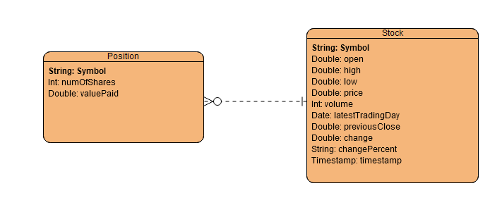

# Introduction (50-100 words) 
This app is a stockquote app that buys, sells, and views stocks. It is built with Java, using PostgreSQL for the database, and using JDBC and AlphaVantage API for database connection and retrieving stock quote data respectively. It was tested with JUnit and Mockito, and deployed using docker.
# Implementaiton 
## ER Diagram 

## Design Patterns 
This app uses the DAO design pattern to separate the app's client interface from its data access mechanisms. It uses the QuoteDAO and PositionDAO classes which have both implemented CRUD operations for data access. Thanks to the DAO design pattern, we are able to keep the database access away from the client facing side of the app, allowing the client side to focus on handling business level problems and creating a more testable and maintainable codebase.
# Test 
To test the app against the database, the first step is to setup the database. Run a PostgreSQL server and create a database for the app. 
The next step is to setup the test data. To do this, create some test data and inject it into the database. Verify that all the data is correct and that the tables are correctly made.
The final step is to run some test queries and verify that results are as expected.
