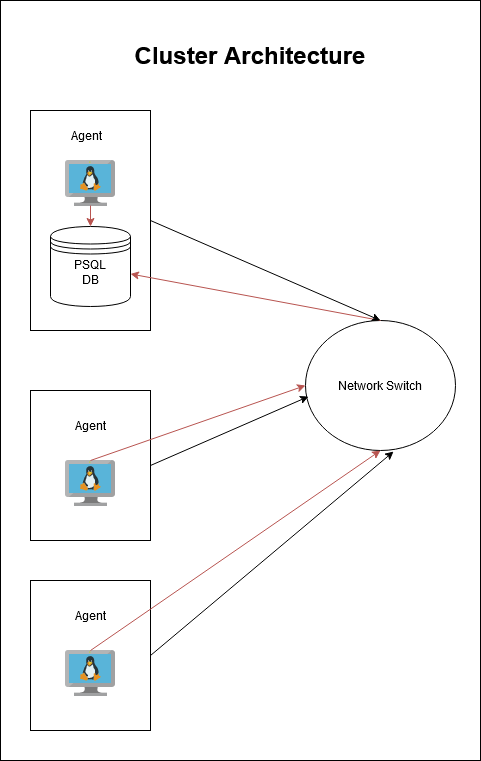

# Introduction
This project aims to assist the Jarvis Linux Cluster Administration (LCA) team in managing their resources for future projects. The team currently manages a Linux cluster of 10 nodes/servers running CentOS 7. The project records the hardware specifications of each node through Bash scripts and monitors node resource usage in real-time using cron jobs. The collected data is stored in a PostgreSQL database run through a docker container. The data collected can help the LCA team plan out their resources in the future so they can possibly save costs on servers and/or time.
# Quick Start
- Start a psql instance using psql_docker.sh
```
bash scripts/psql_docker.sh start
```
- Create tables using ddl.sql
```
psql -h localhost -U postgres -d host_agent -f sql/ddl.sql
```
- Insert hardware specs data into the DB using host_info.sh
```
bash scripts/host_info.sh localhost 5432 host_agent postgres password
```
- Insert hardware usage data into the DB using host_usage.sh
```
bash scripts/host_usage.sh localhost 5432 host_agent postgres password
```
- Crontab setup
```
crontab -e
* * * * * bash /path/to/host_usage.sh localhost 5432 host_agent postgres password
```

# Implemenation
## Architecture


## Scripts
Shell script description and usage (use markdown code block for script usage)
- psql_docker.sh\
Create, Start, or Stop the docker database container.
```
bash scripts/psql_docker.sh start
bash scripts/psql_docker.sh stop
bash scripts/psql_docker.sh create db_username db_password
```
- host_info.sh\
Collect hardware specification data and insert it into the database.
```
bash scripts/host_info.sh localhost 5432 host_agent postgres password
```
- host_usage.sh\
Collect server usage data and insert it into the database.
```
bash scripts/host_usage.sh localhost 5432 host_agent postgres password
```
- crontab\
Schedule the execution of host_usage.sh at regular intervals.
```
crontab -e
* * * * * bash /path/to/host_usage.sh localhost 5432 host_agent postgres password
```

## Database Modeling
Describe the schema of each table using markdown table syntax (do not put any sql code)
- `host_info`
    - `id`: Unique identifier for each host
    - `hostname`: Name of the host
    - `cpu_number`: Number of the CPU being used
    - `cpu_architecture`: CPU architecture
    - `cpu_model`: Type of CPU
    - `cpu_mhz`: CPU speed
    - `l2_cache`: L2 cache size
    - `timestamp`: Timestamp of data insertion
    - `total_mem`: Total memory of the host

- `host_usage`
    - `timestamp`: Timestamp of data insertion
    - `host_id`: Foreign key for connects to host_info table
    - `memory_free`: Available memory
    - `cpu_idle`: Idle CPU usage
    - `cpu_kernel`: CPU kernel
    - `disk_io`: Number of disk operations in progress
    - `disk_available`: Available disk space

# Test
The application was tested on a single machine.

# Deployment
The application is deployed using Docker for the database instance and cron jobs for periodic data collection.

# Improvements
- Implement system to handle hardware updates 
- Strengthen error handling and logging 
- Create visualizations for the data being collected (and possibly a dashboard?)
